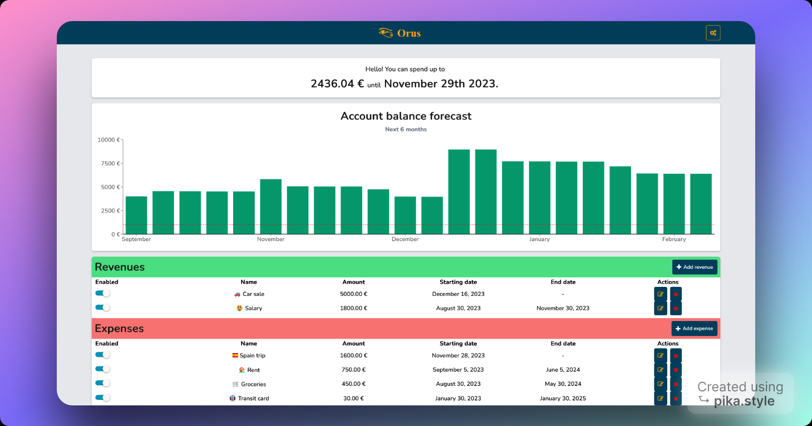

  

    
  

  

    Hi! I'm Julien Pause.
     
     
    I'm a React (& React Native) software engineer from Reunion Island 🇷🇪, based in Paris, France 🇫🇷.
  

**Currently a 5th year student at Epitech Paris, I'm looking for an end-of-studies internship or CDI.**
[Contact me now](mailto:julien.pause@epitech.eu)

I'm an explorer who realized early how much life has to offer.
I try to get the best of it by exploring different cultures and perspectives about life.\
You could call me an optimist absurdist 😊

I speak 🇫🇷 French, 🇺🇸 English, and I'm learning 🇪🇸 Spanish.

I created this website to showcase the projects which I'm proud of, and share my thoughts on different topics.\
My interests include travel, philosophy, football...

## ⭐ Indie Hacking

I plan on running online businesses as a solopreneur.\
I'm currently working on [Orus](https://www.orus.software/?utm_source=julien_pause_website), a personal forecast budgeting SaaS.

## 📚 Books

I read non-fiction books to get the knowledge and insights of people who spent years studying
the subject in great detail. \
I like to think of it as having a discussion with the author, who is just another human being that had the same problems as us.

You can find my reading list on my [GoodReads profile](https://www.goodreads.com/user/show/140095001-julien-pause).\
My favorite book is [Four Thousand Weeks: Time Management for Mortals](https://www.oliverburkeman.com/books) by Oliver Burkeman.

## 🚄 Travel

Travelling has brought me my best memories and experiences in life.\
So far, I've been to 19 different countries:

🇲🇺 Mauritius \
🇫🇷 France \
🏴󠁧󠁢󠁥󠁮󠁧󠁿 England \
🇿🇦 South Africa \
🇦🇺 Australia \
🇹🇭 Thailand \
🇦🇪 United Arab Emirates \
🇲🇾 Malaysia \
🇳🇱 Netherlands \
🇺🇸 United States (California, Oregon, Utah, Arizona, Alaska) \
🇲🇽 Mexico \
🇪🇸 Spain \
🇧🇪 Belgium \
🇨🇿 Czech Republic \
🇦🇹 Austria \
🇸🇰 Slovakia \
🇭🇺 Hungary \
🇸🇮 Slovenia \
🇮🇹 Italy

I realized late how much planes contribute to global warning. \
However, I cannot imagine a world where people cannot travel.

That's why I want to aim my career on the decarbonization of travel by focusing
on the development of trains, which I believe is a more comfortable and sustainable way of travelling.